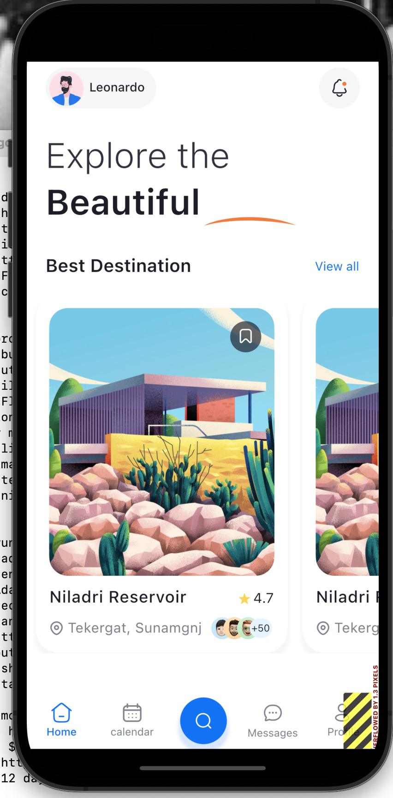
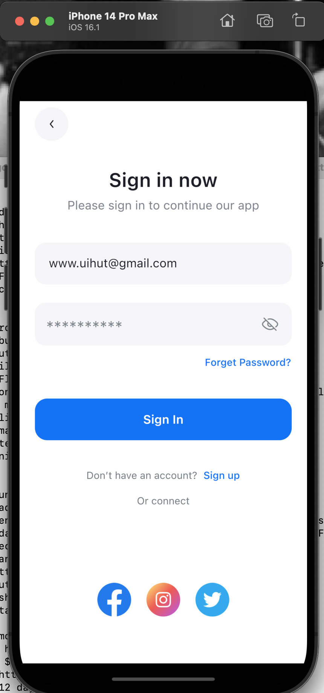
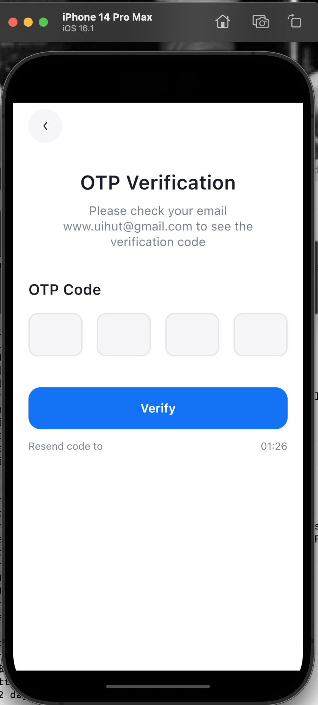
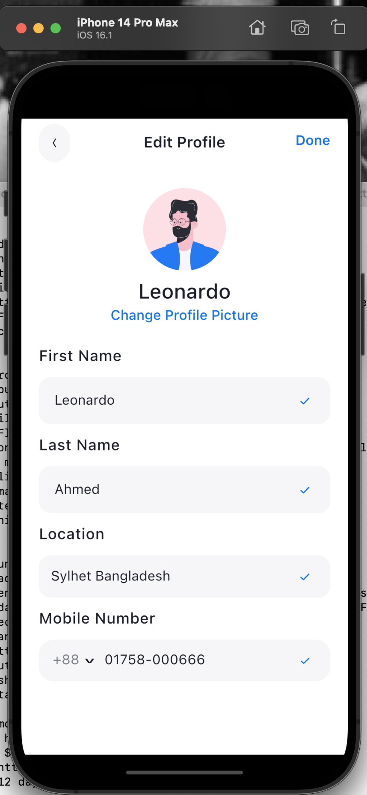

# Review

This is a low-code app. Most interesting part of it is the screen designs.  The code itself appears generated by dhiwise.com and has a lot of boilerplate.  It's missing any data and much of it doesn't work. 

## Screen images






## Installation 

Needed to uncomment `platform :ios, '11.0'` in ios/Podfile to get system to run.

## Usage

* Lots of RenderFlex errors on various pages.
* Some buttons don't appear to work. 
* Appears to be a "low code" app built using <https://docs.dhiwise.com/docs/flutter/intro>, lots of boilerplate and some files without any contents. 

## Directory layout

```
lib/
  core/
    constants/, errors/, network/, utils
    # some interesting files in utils/
  data/
    # empty!
  localization/
    # boilerplate localization code
  presentation/
    # subdirectories, all containing binding/, controller/, models/
    # all models/ empty, controller uses GetxController
  routes/
    # Uses GetPage to define pages and their associated controller
  theme/
    # Some crazy low code non-Material theme. 
  widgets/
    # misc widgets (button, icon, radio) that aren't pages. 
  main.dart
    # semi-interesting main() example
```

## Main.dart

```dart
void main() {
  WidgetsFlutterBinding.ensureInitialized();
  SystemChrome.setPreferredOrientations([
    DeviceOrientation.portraitUp,
  ]).then((value) {
    Logger.init(kReleaseMode ? LogMode.live : LogMode.debug);
    runApp(MyApp());
  });
}

class MyApp extends StatelessWidget {
  // This widget is the root of your application.
  @override
  Widget build(BuildContext context) {
    return GetMaterialApp(
      debugShowCheckedModeBanner: false,
      translations: AppLocalization(),
      locale: Get.deviceLocale, //for setting localization strings
      fallbackLocale: Locale('en', 'US'),
      title: 'travelappflutter',
      initialBinding: InitialBindings(),
      initialRoute: AppRoutes.initialRoute,
      getPages: AppRoutes.pages,
    );
  }
}
```


## pubspec.yaml

```yaml
name: travelappflutter
description: A new Flutter project.
version: 1.0.0+1
environment: 
  sdk: '>=2.12.0 <3.0.0'
dependencies: 
  flutter: 
    sdk: flutter
  get: ^4.6.5
  connectivity_plus: ^2.3.6
  shared_preferences: ^2.0.15
  cached_network_image: ^3.2.1
  flutter_svg: ^0.22.0
  pin_code_fields: ^7.3.0
  sms_autofill: ^2.0.0
  intl: ^0.17.0
dev_dependencies: 
  flutter_test: 
    sdk: flutter
flutter: 
  uses-material-design: true
  assets: 
    - assets/
    - assets/images/
```
